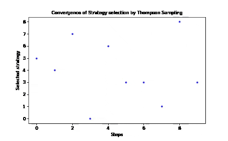
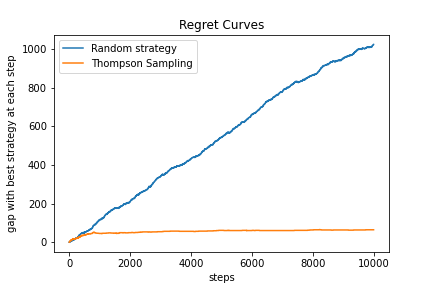
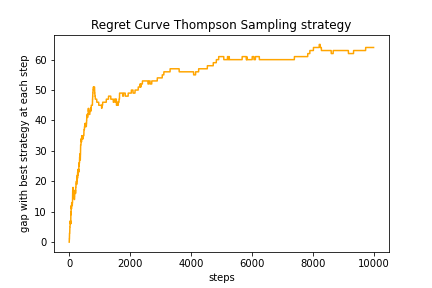

# Maximize-Revenues-with-Thompson-Sampling
Maximize revenues of Online Retail Business with Thompson Sampling algorithm

# Description
In this notebook, the objective is to maximize revenues of an online retail business by selecting the best strategy to convert users to the premium plan.
The project uses Thompson sampling algorithm to identify the best strategy among several options.
The best strategy identified is the one with the highest conversion rate.

# Problem statement
Many business problems can benefit from the approach developped in this project.
Here we assume the objective is to identify the best marketing campaign among several of them (9 strategies used in the project). These strategies can have different features differentiating them from each other. The objective is to identify and leverage as quickly as possible the strategy with the highest conversion rate.
Success of a campaign is measured by the conversion of the exposed customer.
Therefore the best strategy is the strategy genering the maximum conversion to the premium plan. One common application is advertizing or Ads.

# Approach
We measure performance compared to random strategy. In the random strategy, we randomly select the strategy to propose to the customer and then measure conversion. This is repeated over a high number of customers.

In Thompson sampling, the algorithm is able to identify the best strategy very quickly (exploration phase) and progressively predominantly offer this strategy only (exploitation). This allows to optimize the time necessary to explore and identify the best solution and start ripping the profits very quickly. In the project, the algorithm starts proposing primarily the best strategy after less than 500 customer experiments only.

Here we can see the strategies proposed (between 0 to 8) at every time step from the start of the experimentation. Starting from customer 500, the algorithm has already identified the best strategy (strategy n°6) and has started to exploit it to maximize revenues.

# Thompson Sampling algorithm

To learn about Thompson Sampling, you can check out this detailed [tutorial](https://arxiv.org/pdf/1707.02038.pdf).

Thompson Sampling algorithm is a key Reinforcement learning algorithm to solve Multi Armed Bandit type of problems. This refers to situations where you face several similar strategies and need to identify the best one. Multi Armed Bandit problem <=> Identify the machine offering best returns when facing multiple one-armed bandit machines ('bandit manchot') in a casino.
This assumes each machine has its own outcome probability distribution. The objective is to identify the machine with the most favorable distribution as quickly as possible. This allows to maximize revenues and returns. This algorithm offers a solution far more efficient than A/B testing which requires to explore all strategies equally.

Random strategy:
- At each time step (visiting customer), select a strategy randomly.
- Test outcome of strategy on customer (conversion or not). Increment success if conversion is achieved.

Principles of Thompson Sampling algorithm:
- Expected return is modelized by a Beta distribution for each strategy. Beta distribution have 2 parameters (alpha and beta) which the algorithm will update at every time step. The update will be a function of whether the customer was converted or not. For details on Beta distribution, you can check [this](https://en.wikipedia.org/wiki/Beta_distribution) out.
- At time step 0, all strategies start with an equal Beta distribution. The two parameters are both equal to 1 for all strategies.
- At every time step, the algorithm will select the strategy delivering the highest outcome (number between 0 and 1) and update its parameters. During the early exploration phase, this will quickly separate each distributions and progressively re-inforce the best one. Soon the algorithm will select the best strategy at every time step driving its exploitation.

The separation can be illustrated looking at the Expected mean value of a Beta distribution X: E(X) = alpha / (alpha + beta). So increasing alpha if conversion and increasing beta if no conversion will separate the expected means.

# Results

The convergence of Thompson Sampling algorithm is very quick. This is illustrated by the Regret Curves shown below. A regret curve measures the difference between the choosen strategy and the best strategy at every time step.

    

- Thompson Sampling is converging very well towards the best strategy
- No convergence of the Random Strategy towards the Best Strategy

Compared to the random strategy, Thompson sampling can easily deliver significant improvement in a short time frame (over 90% vs random in this project). Such approach can help a business to select the best strategy and transition towards it quickly whether this is a promotional campaign, Ads or an attractive value proposition. Subscription to the premium plan will generate higher revenues from the converted customer.
